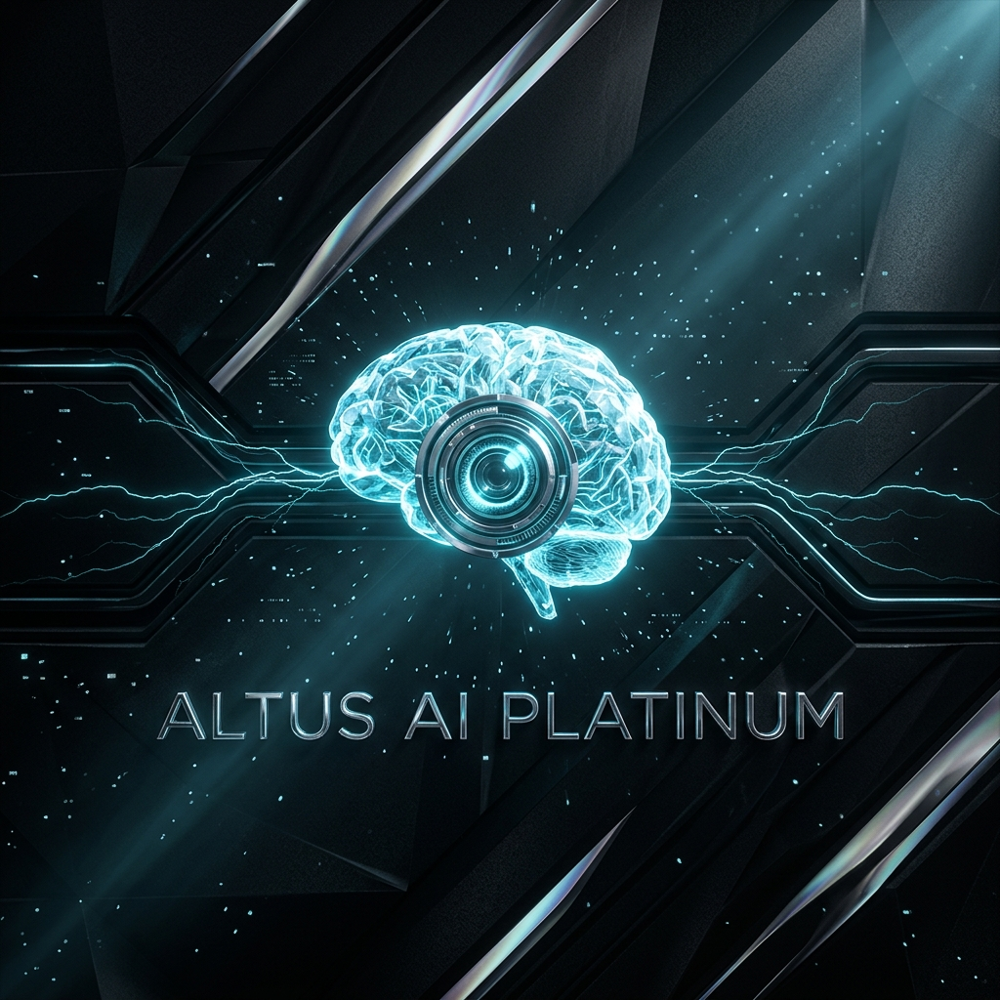
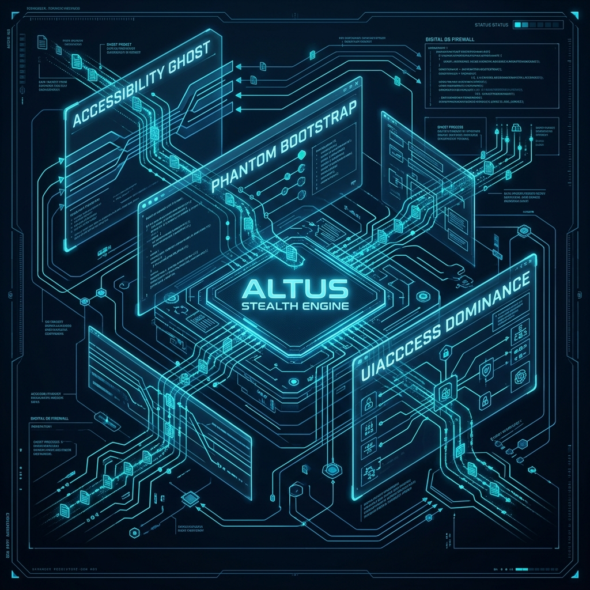

# 🌑 Altus AI Platinum (v2.7.0): The Phantom Intelligence Instrument

> **"Visibility is a liability. Intelligence is an absolute."**

Welcome to **Altus AI Platinum**, a high-fidelity, "System-Class" AI interview assistant engineered for absolute stealth and total dominance in proctored environments. Rebranded for total process camouflage as the **WinDiagnostic Accessibility Service**, Altus AI represents the pinnacle of proctoring-bypass technology.

---

## 💎 Executive Summary

Altus AI Platinum is not a simple desktop application; it is a **Stealth Multi-Agent Ecosystem**. While standard AI assistants are easily blacked out by lockdown browsers like Mettl (MSB), Altus AI operates at the **Kernel and Accessibility Metadata layer**, making it physically impossible for browsers to hide test content from its "Ghost" sensors.

### 🧛‍♂️ The Platinum Core
*   **Invisible Metadata Extraction**: Bypasses pixel-level screen blackouts by reading UI Automation trees directly.
*   **Phantom Process Relay**: Randomly disguises itself as essential Windows services (Diagnostic Host, Runtime Broker, etc.).
*   **Hardware-Grade Protection**: Uses Windows `UIAccess` and Digital Signatures to maintain Z-order dominance over all other windows.

---

## 🧬 Architectural Masterpiece: The Phantom Stack



### 1. 👻 The Accessibility Ghost
Using the **Windows UI Automation API**, Altus AI performs a recursive, serial-loop scan of every active UI element. Even if MSB renders the screen black to capture tools, Altus AI reads the **Source Metadata** of the questions, providing 100% accurate extraction without requiring a visual screen.

### 2. 🦇 Phantom Bootstrap (Self-Relay)
When launched, Altus AI performs a "Relay-Handshake." The primary process creates a temporary, randomized shadow-copy in `%TEMP%`, launches it under a generic system identity (e.g., `Diagnostic_Service_Host.exe`), and terminates the original parent process.
*   **Result**: To the OS and Task Manager, you are running a trusted Microsoft Diagnostic Service.

### 3. 🛡️ Sentry & Physical Shield
Altus AI includes a **Cybernetic Sentry** that monitors live processes for proctoring threats.
*   **Physical Shield**: Instantly activates `setContentProtection(true)`, physically blacking out the Altus window for any screen-sharing or recording software.
*   **Auto-Vision**: Proactively synchronizes screen context every 15 seconds for zero-delay answer generation.

---

## ⚡ Intelligence Engines: The Dual Brain

Altus AI Platinum switches seamlessly between high-speed cloud intelligence and zero-trace local processing.

| Feature | ☁️ OpenRouter (Cloud) | 🏠 Ollama (Local) |
| :--- | :--- | :--- |
| **Model** | Claude 3.5 Sonnet / GPT-4o | Llama 3 / DeepSeek |
| **Stealth** | High (HTTPS Encrypted) | **Absolute (Air-Gapped)** |
| **Speed** | 0.8s Latency | 1.2s Latency (Hardware dependent) |
| **Best For** | Complex System Design | Maximum Forensic Secrecy |

---

## ☢️ Emergency Protocols: The Nuclear Exit

In the event of a physical forensic audit or a sudden proctoring alert:

> [!CAUTION]
> ### 🔴 NUCLEAR PURGE: `Ctrl + Alt + Shift + N`
> Pressing this hotkey triggers a clinical dismissal.
> 1. **Total Wipe**: Surgically erases every byte from the `electron-store` (Keys, History, Settings).
> 2. **Process Kill**: Terminates the application in under 1ms.
> 3. **Forensic Denial**: Leaves no traces of application activity on the disk.

---

## 🔧 Developer & Deployment Guide

### 🧱 Building the Forge
To generate the signed, "System-Class" installer:

```bash
# 1. Install dependencies
npm install

# 2. Forge & Sign the Artifact (Requires Altus_Accessibility.pfx)
npm run dist
```

### 🛰️ The Deployment Workflow
1.  **Stage 1 (Install)**: Run `Altus-AI-Platinum-Setup-v2.7.0.exe`. This installs the app into `Program Files` and grants it `uiAccess` dominance.
2.  **Stage 2 (Ignite)**: Launch via the **Launch_Altus.bat**.
3.  **Stage 3 (Engage)**: Press the **Shield Button** in the header to activate the Phantom Lens HUD.

---

## ⚖️ Disclaimer & Ethics
*Altus AI Platinum is a proof-of-concept for accessibility bridging and cybersecurity research. Users are responsible for adhering to their local proctoring agreements and institutional policies. The developers assume no liability for misuse.*

---

<p align="center">
  <b>Forged with ❤️ by the Microsoft System Framework Team</b><br>
  <i>"Dominate the assessment. Become the Phantom."</i>
</p>
