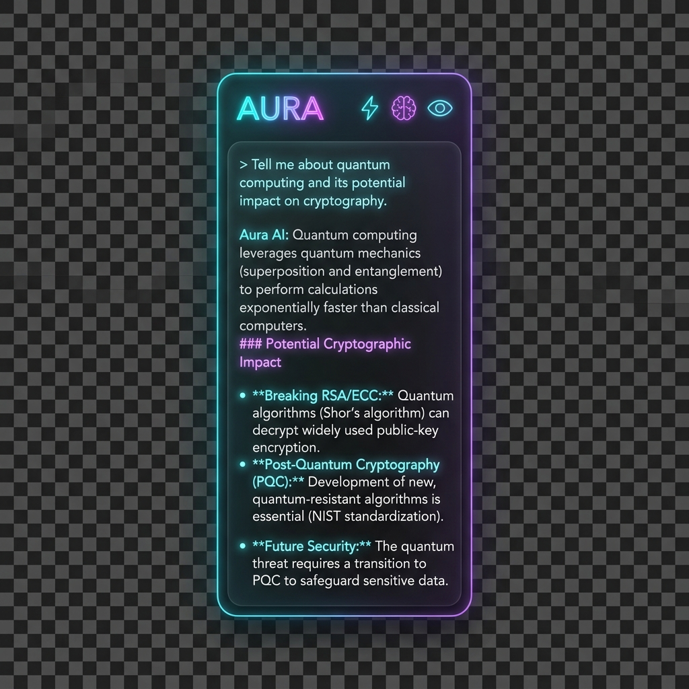
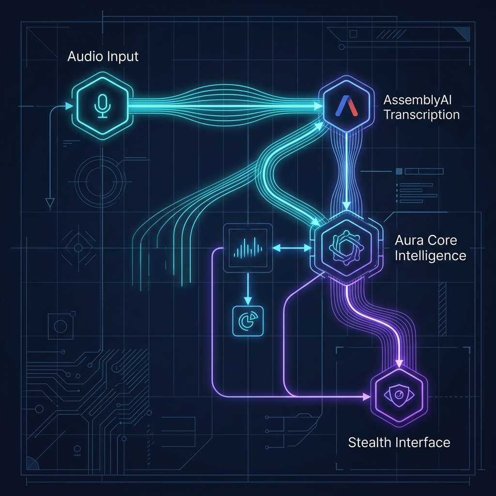
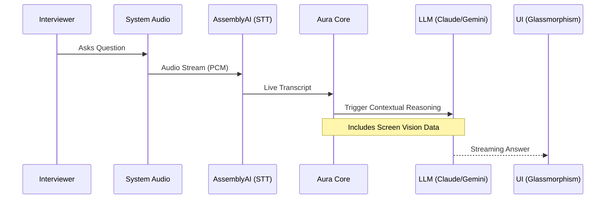
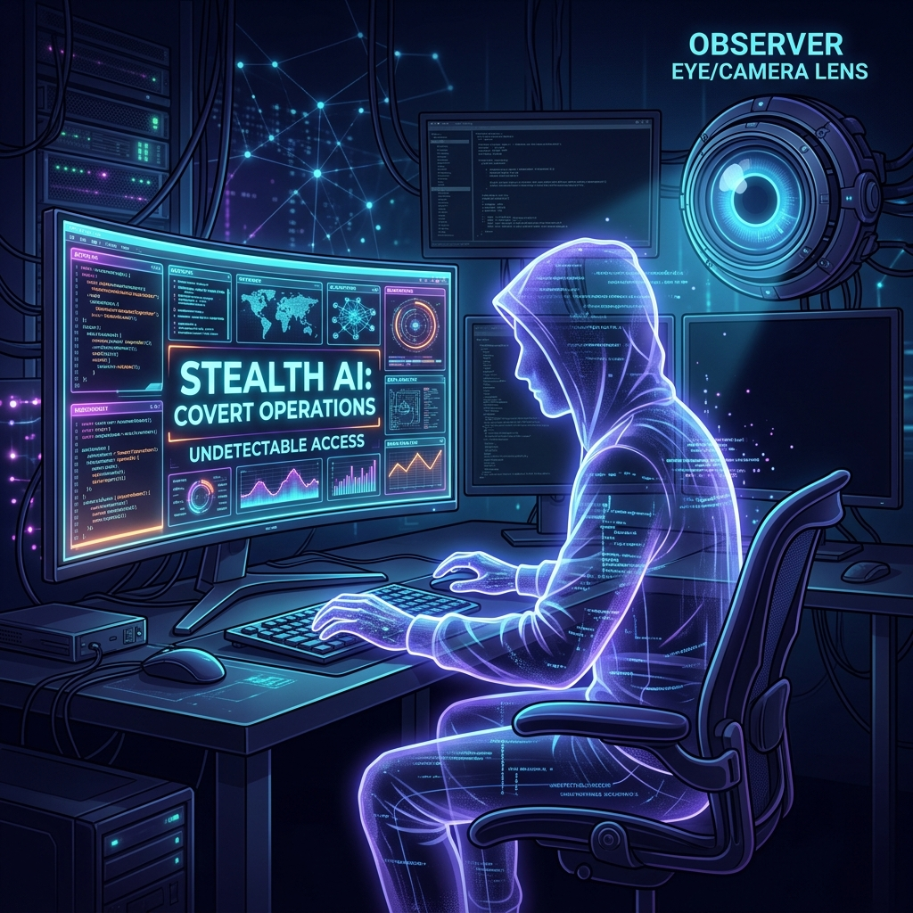

<div align="center">

# 🕵️‍♂️ Aura (Altus-AI) — Stealth Interview Assistant


[](https://opensource.org/licenses/MIT)
[](https://github.com/Hey-Astreon/Altus-Ai)
[](https://github.com/Hey-Astreon/Altus-Ai)
[](https://github.com/Hey-Astreon/Altus-Ai)

---

### **Built With a Modern Stack**
<p align="center">
  
</p>

---

</div>

## 🚀 The Aura Advantage

Aura is a high-performance, undetectable Windows desktop application designed to provide **real-time AI assistance** during online interviews. It sits as a bridge between world-class intelligence and your active window.

| Feature | The Aura Way | Traditional Methods |
| :--- | :--- | :--- |
| **Stealth** | **OS-Level Protection** (Invisible to Zoom/Teams) | Easily detected via screenshare |
| **Input** | **System Audio Loopback** (Direct capture) | Poor mic capture or manual typing |
| **Recall** | **Proactive Auto-Vision** (AI sees your code) | You have to copy-paste code snippets |
| **Logic** | **Dual-Engine** (Turbo vs Deep Genius) | Single fixed-latency model |

---

## 📸 Visual Showcase



---

## 🕹 Interface & Feature Map

### **The Command Center**

````carousel
```markdown
### 👤 Persona Badge
Cycles between **Technical**, **System Design**, and **Behavioral** modes. 
Changing this adjusts the AI's internal logic and response tone.
```
<!-- slide -->
```markdown
### ⚡ Turbo / 🧠 Genius Toggle
- **Turbo**: Lightning speed (Gemini 1.5 Flash). Best for general conversation.
- **Genius**: Deep reasoning (Claude 3.5 Sonnet). Best for complex algorithmic logic.
```
<!-- slide -->
```markdown
### 〰️ Auto-Vision Toggle
Forces Aura to proactively "look" at your screen every 15 seconds. 
Essential for coding rounds where the problem is evolving on screen.
```
````

### **Detailed Button Guide**

| Icon | Name | Description |
| :--- | :--- | :--- |
| **`TECHNICAL`** | **Persona** | Click to cycle expertise: Technical → System Design → Behavioral. |
| **`Turbo/Genius`**| **Model** | Switches between the high-speed engine and the high-reasoning engine. |
| **`〰️`** | **Auto-Sync** | When active (cyan glow), Aura automatically syncs with your screen context. |
| **`👁️`** | **Manual Eye** | Performs an instant, silent capture of your primary screen for AI analysis. |
| **`🗑️`** | **Clear All** | Wipes the current transcript and AI history. |
| **`⚙️`** | **Settings** | Opens the configuration panel for your API keys. |
| **`×`** | **Instant Quit** | Immediately terminates the application. |

---

## 📐 System Architecture





---

## 🛠 Advanced Features

### **1. Total Stealth Mode**

The window uses a low-level OS hook (`SetContentProtection`) which prevents it from being captured by Zoom, Teams, OBS, or Proctoring software. **Only you see the overlay; they see a clean desktop.**

### **2. Security & Encryption**
Aura utilizes the **Windows SafeStorage API** to encrypt your sensitive API keys. They are never stored in plain text and never leave your local machine.

---

## ⌨️ Global Hotkeys

*   **`Ctrl + Shift + V`**: Toggle Visibility (instantly show/hide the app).
*   **`Ctrl + Shift + Q`**: Emergency Panic Kill (instantly closes everything).

---

## 🏁 Installation & Setup

### **For Developers**
1. **Clone**: `git clone https://github.com/Hey-Astreon/Altus-Ai.git`
2. **Install**: `npm install`
3. **Launch**: Double-click `Launch Aura.bat`

### **For Users (.exe)**
1. Navigate to the `release/` folder.
2. Run **`Aura-Setup-1.0.0.exe`**.
3. Launch "Aura AI" from your Desktop.

---

## ⚖️ Responsible AI Usage
> [!CAUTION]
> Aura is intended for **educational and preparation purposes only**. Users must comply with the ethical guidelines of their prospective employers and local regulations. The developers are not responsible for any misuse.

---
<p align="center">Made with ❤️ for the Engineering Community</p>
